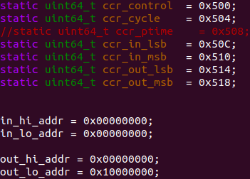
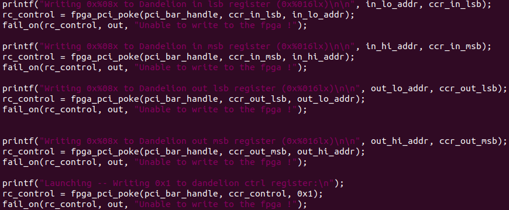

# Hardware accelerator for Hamilton-Jacobi (HJ) Reachability Analysis (README.md in progress)
This is our repository for building accelerators used in solving Hamilton-Jacobi partial differential equation (PDE) on an extended 4D Dubins Car dynamic system, which is supplementary to our IROS 2021 paper "*Real-Time Hamilton-Jacobi Reachability Analysis of Autonomous System With An FPGA*" available **[here](https://sfumars.com/wp-content/papers/2021_iros_fpga.pdf)**. 

Note that if you just want to use our pre-built accelerator on AWS FPGA, please refer to the following **[section](#ready-to-use-accelerator-on-aws-fpga)** for more instructions. In here, you will find:

1. Sources code in Chisel/Scala, documentation of the components in the accelerator architecture, how to compile, and running simulation to verify the hardware correctness

2. Instructions on how to deploy our accelerator on an AWS F1 instance, and how to write a C++ driver and a Pybind wrapper ( which allows calling core C++ functions in Python ) around it that does end-to-end computation on FPGA.

# Prerequisite Installation

## Getting Started on a Local Ubuntu Machine

* **[sbt:](https://www.scala-sbt.org/)** a preferred Scala build system and what Chisel depends on.

* **[Verilator:](https://www.veripool.org/wiki/verilator)**  C++ simulation from Verilog code. The included unit testing infrastructure uses this.


## (Ubuntu-like) Linux

Install Java

```
sudo apt-get install default-jdk
```

Install sbt, which isn't available by default in the system package manager:

```
echo "deb https://dl.bintray.com/sbt/debian /" | sudo tee -a /etc/apt/sources.list.d/sbt.list
sudo apt-key adv --keyserver hkp://keyserver.ubuntu.com:80 --recv 642AC823
sudo apt-get update
sudo apt-get install sbt
```

## Install Verilator.

We currently recommend Verilator version 4.016.

Follow these instructions to compile it from source.

1. Install prerequisites (if not installed already):

    ```bash
    sudo apt-get install git make autoconf g++ flex bison
    ```

2. Clone the Verilator repository:

    ```bash
    git clone http://git.veripool.org/git/verilator
    ```

3. In the Verilator repository directory, check out a known good version:

    ```bash
    git pull
    git checkout verilator_4_016
    ```

4. In the Verilator repository directory, build and install:

    ```bash
    unset VERILATOR_ROOT # For bash, unsetenv for csh
    autoconf # Create ./configure script
    ./configure
    make
    sudo make install
    ```
**Please remember that verialtor should be installed in the default system path, otherwise, chisel-iotesters won't find Verilator and the simulation can not be executed**

## HJ_solver's dependencies

Our current accelerator is using fixed point for computation. However, some inherited packages from the Dandelion project depends on _Berkeley Hardware Floating-Point Units_ for floating nodes. Therefore, before building HJ_solver you need to clone hardfloat project, build it and then publish it locally on your system. Hardfloat repository has all the necessary information about how to build the project, here we only briefly mention how to build it and then publish it.

```
git clone https://github.com/ucb-bar/berkeley-hardfloat.git
cd berkeley-hardfloat
sbt "publishLocal"
```

## Compiling HJ PDE solver accelerator
Run

```
make TOP=HJsolverSimAccel
```
This command generates an executable ending with "libhw.so" that will be used by the simulator later. Also a verilog file HJsolverSimAccel.v will also be generated residing in build/chisel, which is used as part of design files when we synthesize our design for AWS fpga.

## Simulation

One of the easiest way to verify hardware correctness is to write a Python code that initializes data, passes them to the hardware simulation, reads return output and compares with the expected result. This is exactly what **[muIR-Sim](https://github.com/sfu-arch/muir-sim)** does for us, please refer to the page for installation instruction. Results obtained from the python toolbox for HJ reachability anaylsis such as **[optimizedDP](https://github.com/SFU-MARS/optimized_dp)** can be used to verify against the simulated FPGA result. 

# Components overview
 Overview of the accelerator architecture: (1) The accelerator consists of Memory buffer and PEs. The value array V, residing in DRAM, is continuously transferred to the memory buffer which distributes data to the PEs. (2) Every clock cycle, each PE takes new input from the memory buffer to start computing new value function for new indices. (3) Spatial derivatives in all dimensions are computed. (4) Each PE has its own lookup table that's used to quickly index the state values for system dynamics computation. Optimal control is also determined at the same time. (5) The Hamiltonian term and the dissipation are obtained. (6) New output values are computed and written back to DRAM (this is a bit simplified, it's actually written to a buffer queue before written back to DRAM, more details below).

### Processing Element (PE):
*/src/main/scala/stencil/PE_4d.scala*

This file contains RTL implementation of the processing element (PE as shown in the above figure) that computes new value function based on level-set algorithm for an extended 4D Dubins Car dynamics.

### Memory buffer:
*/src/main/scala/stencil/parallel_reuseBuffer.scala*

This file contains RTL implementation of the FIFO queues used in our memory architecture described in the paper. 

### Accelerator
*/src/main/scala/stencil/HJSolver_4D.scala*

This RTL files instantiates our previous memory buffer and processing elements appearing in the overall architecture. Currently, we are instantiating 4 PEs for parallizing the computation. In addtion, this file instantiates buffer queues for sending/receiving data from DRAM and contains the Finite State Machine (FSM) logic for issuing read and write commands to the arbiter modules. These interactions are illustrated in the figure below.


# Ready-to-use accelerator on AWS FPGA 
Our pre-built Amazon FPGA Image (AFI) is **agfi-022913011f2080855**. This image is only available in the **US West (Oregon)** zone, and please note that the image is exactly as what is used in the experiment section of our paper, which works on a grid size of 60x60x20x36 and runs for exactly 67 iterations. We plan on parametrize these numbers at runtime in the future.

To use an FPGA instance on AWS, grab a **f1.2xlarge** EC2 instance and choose the **FPGA Developer** AMI. If this is your first time using AWS and none of that makes sense to you, please follow more instrustions **[here](https://docs.aws.amazon.com/AWSEC2/latest/UserGuide/EC2_GetStarted.html)** . Once an FPGA instance is obtained, you can follow the instructions on **[aws-fpga/hdk](https://github.com/aws/aws-fpga/tree/master/hdk)** to get the neccessary sofware, specifically step 4 through 5. 
On step 5, you can load our image to FPGA running at 196Mhz using the following command:
```
sudo fpga-load-local-image -S 0 -I agfi-022913011f2080855 -a 196
```

That's it ! We now have our design running on an FPGA. But we still need to do a bit more work in order to interface to the accelerator on FPGA from our host program

# Writing codes that interact with FPGA
First, on the FPGA instance, you need to clone the **[aws-fpga](https://github.com/aws/aws-fpga)** repo if you haven't already. We have provided a sample driver code **[test_hjsolver_dram.c](https://github.com/sfu-arch/HJ_solver/blob/main/test_hjsolver_dram.c)** here for your reference. For convenience, you can just copy paste the code into the folder **aws-fpga/hdk/cl/examples/cl_dram_dma/software/runtime/** and modify the Makefile accordingly to correctly compile our newly added file. ( Remember to link with test_dram_dma_common library )

Let us explain what is happening in this code in more details. To correctly offload the specialized computation from the host program to the FPGA, the following information has to be shared between the host and the FPGA: input data addresses (FPGA's DRAM side), output data addresses (FPGA's DRAM side), when the computation should start, and when the computation has finished. On FPGA, these information are stored in a set of control registers that can be written and read by both host program and fpga’s custom logic. In particular, the design’s control registers include two write address registers, two read address registers, a cycle counter register and a launch register. The definitions of these control registers are defined in the file **src/main/scala/shell/DCRF1.scala**. In the host program, these registers’ addresses are mapped to the custom logic’s registers through the PCIe bus. By writing to these mapped addresses, we can interface to the custom logic design from our host program (shown in below figures). Control registers on FPGA can be accessed in C++ program by writing to PCI mapped addresses using function call fpga_pci_poke provided by AWS FPGA software library.





To kickstart the computation on FPGA, the launch register is written 1 by the host program, and written 2 by the FPGA when the computation has finished. To determine if the computation on FPGA has finished, the host program will poll for the computation status on the FPGA by continuously evaluating the value of the launch register. 


Finally, input data from the host program can be written to the FPGA’s DRAM using DMA function calls, and output results on the FPGA side can be read back by the host program using the DMA burst read function.


<!---
# Pybind wrapper for our code (optional)
We have some example codes available at **[here](https://github.com/sudo-michael/jetracer_controller/tree/aws_controller/scripts)**

You need  we need to build a Python executable from C++ codes 
```
g++ -I/home/centos/src/aws-fpga/sdk/userspace/include -O3 -std=c++11 -fPIC $(python3 -m pybind11 --includes) -c test_compile.cpp -o new_example.o

// Link 
g++ -DCONFIG_LOGLEVEL=4 -g -Wall -Werror -I/home/centos/src/aws-fpga/sdk/userspace/include -O3 -shared -std=c++11 -fPIC $(python3 -m pybind11 --includes) -o newexample$(python3-config --extension-suffix) new_example.o test_dram_dma_common.o -lfpga_mgmt -lm
```
--->


